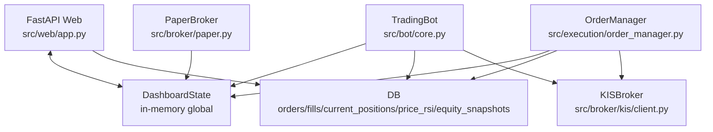
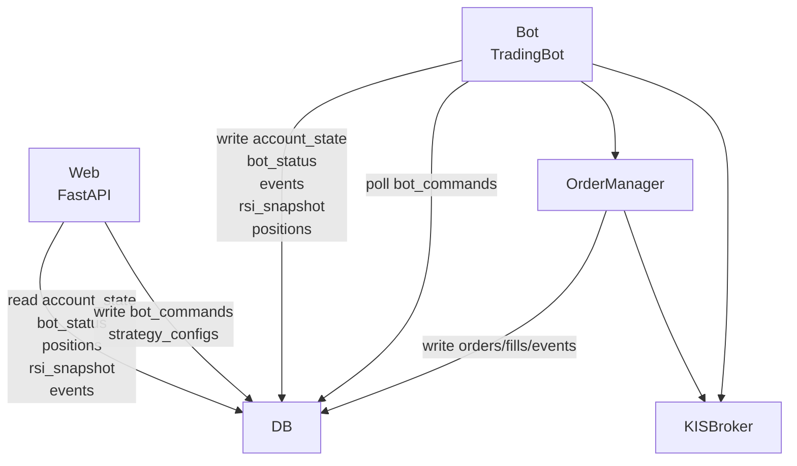

# BeRich 아키텍처 비판 토론

> [!note] 작성 맥락
> 초기 작성 시점에는 Claude CLI가 로그인되어 있지 않아 실제 호출 없이 작성했다.
> 이후 `claude auth login`을 완료했고, Claude CLI에 핵심 코드 근거 요약을 전달해 실제 반론을 받았다.
> 단, Claude의 읽기 도구 기반 전체 저장소 리뷰 호출은 장시간 출력이 없어 중단했으므로, "실제 Claude CLI 반론"은 Codex가 확인한 코드 근거 요약에 대한 반론이다.

## 한 줄 결론

이 프로젝트의 핵심 문제는 `src/web/app.py`가 크다는 것이 아니다. 더 근본적인 문제는 **화면용 in-memory 상태인 `DashboardState`가 봇 제어 plane, 주문 판단 입력, 인증 토큰 공유, 전략 hot reload까지 떠안고 있다는 점**이다.

따라서 다음 리팩토링의 이름은 "웹 앱 분리"보다 **주문 경로에서 presentation state 제거**가 더 정확하다.

---

## 검토 범위

검토 기준:

- `README.md`의 현재 아키텍처와 DB-first 전환 방향
- `TODO.md`의 Bot/Web 완전 분리 로드맵
- `src/bot/core.py`
- `src/bot/dashboard_sync.py`
- `src/execution/order_manager.py`
- `src/broker/paper.py`
- `src/broker/kis/client.py`
- `src/data/models.py`
- `src/data/storage.py`
- `src/web/app.py`
- 관련 테스트

검증한 명령:

```bash
uv run --locked pytest
```

결과:

```text
315 passed in 10.62s
```

테스트는 녹색이다. 하지만 이 문서의 논점은 "현재 테스트가 깨진다"가 아니라, **테스트가 통과해도 운영/분리/라이브 트레이딩 리스크가 아직 닫히지 않았다**는 것이다.

---

## 현재 구조 요약

문서상 목표는 명확하다.

- 봇은 DB writer
- 웹은 DB reader/control-command writer
- 봇/실행/브로커 코드에서 `src.web.app` import 제거
- 현재 잔고는 `account_state` 단일 row
- pause/resume/reload/settings apply는 `bot_commands` 큐

하지만 현재 코드의 실제 의존 흐름은 아직 이렇다.



DB가 일부 source of truth가 되어 가고 있지만, `DashboardState`는 아직 단순 cache가 아니다. 아래 역할을 동시에 한다.

- 화면 표시 상태
- 봇 상태 저장소
- pause/resume 제어 flag
- 전략 reload callback 전달자
- strategy instance 공유 공간
- KIS config/auth token 공유 공간
- 주문 수량 계산에 필요한 balance/position 공급자
- PaperBroker fill RSI 공급자

이 혼합이 가장 큰 구조적 위험이다.

---

## 토론 원칙

이 문서는 두 목소리로 구성한다.

- **Claude 역할:** 공격적인 리뷰어. "이 설계가 실제 돈을 다룰 때 어디서 실패하는가?"를 묻는다.
- **Codex 역할:** 코드 근거로 동의/반박/수정한다. 과장된 비판은 줄이고, 실제로 먼저 고쳐야 할 순서를 정한다.

---

## 실제 Claude CLI 반론 요약

로그인 후 Claude CLI에 다음 코드 근거를 요약해 전달했다.

- `src/bot/core.py`가 `src.web.app.get_dashboard_state`를 import하고 `DashboardState`에 storage/db_url/KIS config/auth token/strategy instances/reload callback을 주입한다.
- `src/execution/order_manager.py`가 `get_dashboard_state`를 import해서 `trading_paused`, `balance_usd`, `positions`, `cash_usd + cash_krw`를 주문 판단과 매수 수량 계산에 사용한다.
- `src/web/app.py`의 pause/resume API는 in-memory `dashboard_state.trading_paused`만 바꾼다.
- strategy CRUD 후 `dashboard_state.reload_callback`을 `asyncio.create_task`로 호출한다.
- `src/data/storage.py`는 앱 시작 시 `create_all`과 ad hoc migration을 수행하고 `current_positions`를 drop/recreate할 수 있다.
- US 24h 거래는 주문 라우팅 테스트는 있지만 정규장 외 price endpoint `HHDFS00000300` 검증이 남아 있다.

Claude는 Codex의 큰 방향, 즉 `OrderManager`의 `DashboardState` 의존 제거에는 동의했다. 다만 우선순위는 일부 반박했다.

Claude의 수정된 위험 순위:

1. **in-memory `trading_paused` kill-switch**  
   재시작 또는 Bot/Web 분리 시 pause 버튼이 조용히 무력화될 수 있으므로 가장 위험하다.
2. **`reload_callback`과 `strategy_instances` 직접 참조**  
   Web loop에서 Bot 객체와 strategy 인스턴스를 건드릴 수 있어 cross-loop/race condition 위험이 있다.
3. **`_calculate_buy_quantity()`의 `DashboardState` 의존**  
   balance/position staleness와 KRW/USD mixing이 함께 존재한다.
4. **`storage.py`의 destructive startup migration**  
   `current_positions` drop/recreate는 운영 DB에서 위험하다.
5. **정규장 외 `HHDFS00000300` 가격 검증 미완료**  
   US 24h live 활성화 전 반드시 운영 검증이 필요하다.

Claude의 핵심 반박:

> Codex가 맞는 타깃인 `order_manager.py`의 `DashboardState`를 잡았지만, KRW/USD mixing을 너무 앞에 둔 것은 과하다. 현재 `us_only=True`라 `cash_krw`가 0이면 dormant bug일 수 있다. 더 즉각적인 위험은 in-memory pause가 safety kill-switch라는 점과 reload callback/strategy reference가 프로세스 분리 시 조용히 깨지는 점이다.

Codex의 조정된 판단:

- `OrderManager`의 dashboard 의존 제거는 여전히 핵심이다.
- 하지만 첫 PR은 "수량 계산"만이 아니라 **pause kill-switch와 reload callback을 DB command로 옮기는 작업**을 더 앞에 둘 수 있다.
- KRW/USD mixing은 고쳐야 하지만, 실제 운영 위험 우선순위에서는 pause/reload보다 뒤다.

---

# 1. `DashboardState`는 cache가 아니라 hidden control plane이다

## Claude 역할의 비판

`DashboardState`라는 이름이 문제를 흐린다. 이 객체는 대시보드 상태가 아니다. 실제로는 다음을 모두 한다.

- trading pause flag
- bot reload callback
- strategy instance registry
- KIS auth token holder
- balance/account snapshot
- position snapshot
- signal/order/trade log buffer
- RSI latest snapshot

즉 이 객체는 UI cache가 아니라 **프로세스 내부 control plane**이다.

문제는 control plane이 `src/web/app.py` 안에 있다는 점이다. 봇, 주문 관리자, 페이퍼 브로커가 웹 모듈을 import해서 전역 객체를 읽는다. 이 구조에서는 웹을 죽이면 봇도 개념적으로 불안정해지고, 봇을 분리하면 웹 제어가 자연스럽게 무효화된다.

## 코드 근거

`TradingBot`이 웹 모듈을 직접 import한다.

- `src/bot/core.py:20`  
  `from src.web.app import get_dashboard_state`
- `src/bot/core.py:45`  
  `self.dashboard = get_dashboard_state()`

`TradingBot.initialize()`는 웹 상태에 DB URL, KIS config, auth token, strategy instances, reload callback을 넣는다.

- `src/bot/core.py:101-103`  
  dashboard에 storage/db_url 주입
- `src/bot/core.py:105-111`  
  dashboard에 KIS config 주입
- `src/bot/core.py:137-140`  
  dashboard에 KIS auth token 주입
- `src/bot/core.py:153-160`  
  strategy instances와 reload callback 주입

`DashboardState` 자체도 봇 전용 필드를 들고 있다.

- `src/web/app.py:270-274`  
  storage/db_url
- `src/web/app.py:279-283`  
  KIS config/auth token
- `src/web/app.py:285-289`  
  strategy instances/reload callback
- `src/web/app.py:291-292`  
  trading pause flag

`OrderManager`도 웹 모듈을 직접 import한다.

- `src/execution/order_manager.py:20`  
  `from src.web.app import get_dashboard_state`

`PaperBroker`도 fill 생성 시 웹 상태에서 RSI를 읽는다.

- `src/broker/paper.py:191-197`

## Codex의 판단

이 비판은 맞다. 현재 구조에서 `DashboardState`는 UI 상태라는 이름을 달고 있지만 실제로는 **의사결정 입력과 제어 명령 전달자**다.

이건 단순한 코드 smell이 아니다. 자동매매 봇에서는 다음 실패로 이어질 수 있다.

- 웹 프로세스를 별도로 띄우면 pause/resume이 봇에 전달되지 않는다.
- 웹 재시작 시 pause 상태가 사라진다.
- reload callback이 없으면 사용자는 설정 변경이 적용됐다고 믿지만 봇은 예전 전략을 계속 돌릴 수 있다.
- balance/position snapshot이 stale이면 주문 수량 계산이 틀어진다.
- auth token을 웹 전역 상태로 공유하면 보안/수명/동시성 문제가 생긴다.

> [!danger] 핵심 위험
> "화면에 보이는 상태"와 "주문 판단에 쓰이는 상태"가 같은 객체에 있다.
> UI cache가 stale한 것은 UX 문제지만, 주문 입력이 stale한 것은 손실/거래 실패 문제다.

## 반론

현재는 단일 프로세스/단일 코드베이스에서 돌고 있고 테스트도 통과한다. 그러면 당장 위험하지 않은 것 아닌가?

## 재반박

현재 테스트가 통과하는 이유는 현재 결합을 전제로 테스트가 작성되어 있기 때문이다.

예를 들어 `tests/test_execution.py`는 `src.execution.order_manager.get_dashboard_state`를 patch한다. 이건 `OrderManager`가 dashboard를 읽는 구조를 검증하는 테스트이지, 그 구조가 안전하다는 증거가 아니다.

또한 `TODO.md` 자체가 이미 이 결합을 문제로 인정한다.

- `src.bot.core.py`에서 `get_dashboard_state` 제거
- `src.execution.order_manager.py`에서 `get_dashboard_state` 제거
- `src.broker.paper.py`에서 `get_dashboard_state` 제거
- `broadcast_update` 제거

결론: 지금부터의 리팩토링은 app.py를 예쁘게 나누는 일이 아니라, **거래 판단과 웹 표시 상태를 분리하는 일**이어야 한다.

---

# 2. 주문 수량 계산이 dashboard snapshot에 의존한다

## Claude 역할의 비판

가장 먼저 손대야 할 파일은 `src/web/app.py`가 아니라 `src/execution/order_manager.py`다.

주문 수량 계산은 트레이딩 봇의 핵심 안전 경로다. 그런데 현재 매수 수량 계산이 `DashboardState`에서 balance, cash, positions를 읽는다. 이건 위험하다.

더 나쁜 점은 USD와 KRW cash를 그냥 더한다는 것이다.

## 코드 근거

`OrderManager._on_signal()`은 pause 상태를 dashboard에서 읽는다.

- `src/execution/order_manager.py:99-103`

매수 수량 계산은 dashboard balance를 읽는다.

- `src/execution/order_manager.py:226-228`

현재 포지션 평가액도 dashboard positions에서 읽는다.

- `src/execution/order_manager.py:256-259`

사용 가능 현금은 USD와 KRW를 단순 합산한다.

- `src/execution/order_manager.py:277-278`

```python
cash = float(dashboard.cash_usd + dashboard.cash_krw)
```

## Codex의 판단

이건 high-priority 리스크다.

`dashboard.cash_usd + dashboard.cash_krw`는 통화 단위가 다르다. US-only 봇에서 `cash_krw`가 보통 0이라면 지금은 잠복 버그일 수 있지만, KRW cash가 들어오는 순간 수량 계산이 크게 틀어질 수 있다.

예:

- `cash_usd = 1,000`
- `cash_krw = 1,000,000`
- 현재 코드는 `1,001,000`을 USD처럼 취급한다.

실제 KISBroker가 현금 부족 주문을 거절할 수는 있다. 하지만 그건 "안전장치"가 아니라 "브로커가 마지막에 막아주는 우연"이다. 주문 시스템 내부에서 잘못된 수량을 생성하는 것 자체가 실패다.

PaperBroker는 실제 cash bucket을 market별로 따로 관리할 가능성이 높기 때문에 최종 reject될 수 있지만, 그러면 페이퍼와 라이브의 실패 양상이 달라진다. 테스트와 운영 관찰이 왜곡된다.

## 반론

RiskManager가 order validation을 하니까 괜찮지 않은가?

## 재반박

RiskManager는 중요한 방어층이지만, 잘못된 입력을 정상화하는 역할이 아니다. 현재 risk equity도 dashboard balance 기반으로 초기화된다.

- `src/bot/core.py:121-123`

즉 dashboard snapshot이 source가 되는 순간, risk layer도 같은 오염원에 의존할 수 있다.

## 결정

`OrderManager`는 dashboard를 읽으면 안 된다.

대안:

- pause 상태: `self.bot._trading_paused` 또는 command-derived state
- account balance: broker 또는 `account_state` DB row
- current positions: broker 또는 `current_positions` DB row
- max_weight: strategy config service/storage
- cash: market/currency별로 분리

> [!todo] 즉시 수정 후보
> `OrderManager._calculate_buy_quantity()`를 dashboard-free로 바꾼다.
> 이 작업은 Bot/Web 완전 분리보다 먼저 해도 된다.

---

# 3. pause/resume은 "상태 변경"이 아니라 "명령 처리"여야 한다

## Claude 역할의 비판

현재 pause/resume API는 웹 메모리 flag만 바꾼다.

이건 운영 제어 기능으로는 부족하다.

사용자는 "일시정지" 버튼을 눌렀을 때 봇이 멈췄다고 믿는다. 하지만 분리 배포 후에는 웹의 flag와 봇의 실제 상태가 다를 수 있다. 버튼이 성공 응답을 반환해도 봇이 명령을 처리했는지 알 수 없다.

## 코드 근거

현재 pause/resume API:

- `src/web/app.py:1438-1450`

```python
dashboard_state.trading_paused = True
dashboard_state.trading_paused = False
```

`OrderManager`는 이 flag를 직접 읽는다.

- `src/execution/order_manager.py:99-103`

## Codex의 판단

동의한다. pause/resume은 단순 state write가 아니라 command lifecycle이어야 한다.

필요한 상태:

- command created
- command picked up by bot
- command applied
- command failed
- command timed out
- command superseded

사용자는 "요청이 들어갔다"와 "봇이 실제로 멈췄다"를 구분해서 봐야 한다.

## 제안하는 `bot_commands` 모델

필드 예시:

```text
id
command_type        pause | resume | reload_strategies | settings_apply
payload_json
status              pending | running | done | failed | cancelled | expired
dedupe_key
requested_by
requested_at
started_at
finished_at
heartbeat_at
lease_owner
attempt_count
result_json
error_message
```

핵심 규칙:

- 같은 command_type의 pending command는 중복 생성하지 않는다.
- `pause`와 `resume`은 서로 supersede 관계다.
- `reload_strategies`는 최근 config version을 payload에 넣는다.
- 봇은 command를 lease 잡고 처리한다.
- lease가 오래 갱신되지 않으면 failed/expired 처리한다.
- 웹은 command status를 보여준다.

## 반론

지금은 단일 프로세스라 command queue는 과하다.

## 재반박

이 프로젝트의 명시 목표는 K8s에서 봇과 웹을 독립 배포하는 것이다. 목표 구조가 이미 분산 시스템이라면, 제어 명령도 분산 시스템 방식으로 설계해야 한다.

게다가 command queue는 K8s 이후에만 필요한 게 아니다. 지금도 다음 문제를 해결한다.

- 사용자가 pause를 눌렀는데 봇이 적용했는지 알 수 없음
- 설정 변경 후 reload 실패를 UI가 알 수 없음
- 새 전략 생성/활성화가 event loop 교차 접근에 의존함
- 재시작 중 요청된 명령이 사라짐

`TODO.md`에도 이미 같은 방향이 적혀 있다.

- `/api/trading/pause` -> `bot_commands`에 `pause` 생성
- `/api/trading/resume` -> `bot_commands`에 `resume` 생성
- Strategy CRUD 변경 후 `reload_strategies` command 생성

결론: command queue는 나중 문제가 아니라 분리 작업의 중심이다.

---

# 4. strategy reload callback은 event loop 경계에서 불안정하다

## Claude 역할의 비판

웹 API가 strategy config를 수정한 뒤 `dashboard_state.reload_callback`을 호출한다. 이 callback은 bot method다. 웹과 봇이 같은 프로세스/같은 loop에 있다고 가정한다.

그런데 `TODO.md`는 이미 "웹 UI runs in a separate thread/loop" 같은 힌트를 준다. 그렇다면 `asyncio.create_task(_reload())`가 어느 loop에서 실행되는지, bot 객체의 내부 상태를 다른 loop에서 만져도 되는지 불분명하다.

## 코드 근거

strategy 생성/수정/삭제 후 callback 호출:

- `src/web/app.py:2391-2401`
- `src/web/app.py:2460-2470`
- `src/web/app.py:2501-2508`

`TradingBot.initialize()`에서 callback을 dashboard에 넣는다.

- `src/bot/core.py:158-160`

`TODO.md`도 이 한계를 인정한다.

- "새 전략 생성/활성화는 `_sync_enabled_symbols`가 아니라 `reload_callback`에 의존"
- "`asyncio.create_task`로 웹 루프에 스케줄 -> 봇 루프 객체 교차 접근(불안정)"

## Codex의 판단

이 비판도 맞다. `reload_callback`은 제거해야 한다.

다만 바로 모든 reload 기능을 command queue로 바꾸기 전에, 중간 단계로 다음을 할 수 있다.

1. 웹은 DB config만 수정한다.
2. 봇은 주기적으로 config version/hash를 읽는다.
3. 변경 감지 시 봇 자신의 loop 안에서 reload한다.
4. 웹은 "reload requested"와 "bot applied config version"을 구분해 표시한다.

`bot_commands`를 도입하면 더 명시적이다.

## 결정

전략 reload는 callback이 아니라 DB-mediated command 또는 bot-side polling이어야 한다.

---

# 5. DB-first 전환에서 `account_state`는 선택이 아니라 필수다

## Claude 역할의 비판

현재 DB에는 `current_positions`, `price_rsi`, `equity_snapshots`, `orders`, `fills`가 있다. 하지만 "현재 계좌 상태"가 없다.

`equity_snapshots`는 time series고, `current_positions`는 포지션 보유 정보다. 현재 cash, total equity, PnL, last balance fetch status, stale 여부를 표현할 단일 row가 없다.

그래서 현재 balance는 dashboard memory에 남는다.

## 코드 근거

`DashboardState` balance fields:

- `src/web/app.py:219-228`

봇 balance update는 dashboard fields를 갱신한다.

- `src/bot/dashboard_sync.py`의 `_fetch_and_apply_balance()`
- `src/bot/dashboard_sync.py`의 `_update_balances()`

DB에는 `EquitySnapshot`은 있지만 current account row가 없다.

- `src/data/models.py`의 `EquitySnapshot`

## Codex의 판단

동의한다. `account_state`는 Step 1에서 반드시 들어가야 한다.

`equity_snapshots`를 current state로 재사용하면 안 된다.

이유:

- snapshot은 append-only history다.
- current state는 overwrite/upsert 대상이다.
- snapshot 주기가 5 ticks라면 현재 balance와 차이가 날 수 있다.
- UI가 최신 row를 current로 해석하면 stale 판단이 어렵다.
- "balance fetch failed" 같은 상태를 표현하기 어렵다.

## 제안하는 `account_state`

단일 row:

```text
id = 1
total_krw
total_usd
cash_krw
cash_usd
pnl_krw
pnl_usd
position_value_krw
position_value_usd
adjusted_total_usd
settlement_adjustment_usd
source                kis | paper | manual | unknown
last_balance_fetch_at
last_success_at
last_error
updated_at
```

웹은 이 row를 읽어서 표시한다. 주문 수량 계산은 가능하면 broker live call을 우선하고, fallback으로 `account_state`를 쓸 경우 stale threshold를 엄격히 둔다.

> [!warning] stale 정책 필요
> `account_state.updated_at`이 오래됐는데도 주문 수량 계산에 쓰면 DB-first가 오히려 stale-first가 된다.

---

# 6. `rsi_snapshot`은 `price_rsi`와 별개로 필요하다

## Claude 역할의 비판

현재 `price_rsi`는 history table이다. 대시보드가 최신 RSI를 보려면 symbol별 latest row를 찾아야 한다. 이것은 읽기 비용뿐 아니라 의미도 불명확하다.

특히 US 24h 전략에서 RSI는 "직전 정규장 종가 window + 현재가 live slot"이라는 특수 의미를 갖는다. 단순 price history row와 현재 decision snapshot은 분리하는 편이 낫다.

## 코드 근거

`current_positions` 조회 시 각 position마다 latest `PriceRSIModel`을 다시 조회한다.

- `src/data/storage.py:get_current_positions()`

현재 `DashboardState`에는 `rsi_values`, `rsi_prices`, `rsi_history`가 섞여 있다.

- `src/web/app.py:212-214`
- `src/web/app.py:235-237`

## Codex의 판단

동의한다. `rsi_snapshot`은 단순 최적화가 아니다. "현재 전략 입력 상태"를 표현하는 테이블이다.

제안 필드:

```text
symbol
market
price
rsi
rsi_period
base_date
live_price_at
source
updated_at
```

추가로 다음도 고려할 수 있다.

- `window_ready` boolean
- `required_history`
- `history_count`
- `last_confirmed_daily_bar_date`
- `stale_reason`

웹은 `rsi_snapshot`을 읽는다. `price_rsi`는 chart/history 용도로 유지한다.

---

# 7. app startup migration은 운영 DB에서 위험하다

## Claude 역할의 비판

현재 `Storage.initialize()`가 앱 시작 시 `Base.metadata.create_all`과 migration을 수행한다. 더 위험한 것은 기존 column이 있으면 `current_positions`를 drop/recreate하는 로직이다.

이건 로컬 개발에서는 편하지만, 운영 DB와 K8s에는 부적절하다.

## 코드 근거

`Storage.initialize()`:

- `src/data/storage.py:34-39`

Ad hoc migration:

- `src/data/storage.py:41-90`

`current_positions` drop/recreate:

- `src/data/storage.py:64-78`

SQLAlchemy engine pool 설정도 TODO에 남아 있다.

- `pool_size=5`
- `max_overflow=10`
- `pool_recycle=3600`
- `pool_pre_ping=True`

현재 engine 생성:

- `src/data/storage.py:29`

```python
self.engine = create_async_engine(database_url, echo=False)
```

## Codex의 판단

강하게 동의한다.

K8s에서 bot/web 두 deployment가 동시에 뜬다고 가정하면, 앱 시작 시 schema mutation은 다음 문제를 만든다.

- 두 프로세스가 동시에 migration 시도
- schema 변경 중 한쪽이 query 실행
- drop/recreate 중 데이터 손실
- 배포 롤백 시 schema/code mismatch
- migration 실패가 앱 기동 실패로 연결

## 결정

versioned migration을 먼저 도입한다.

권장:

- Alembic 도입
- `Storage.initialize()`는 운영 모드에서 migration 수행 금지
- tests/local bootstrap만 `create_all` 허용
- destructive migration은 명시 migration 파일로만 수행
- DB schema version을 배포 절차에 포함

> [!danger] 운영 원칙
> 앱 시작은 schema를 바꾸면 안 된다.
> 앱 시작은 현재 schema가 기대 버전인지 확인만 해야 한다.

---

# 8. WebSocket broadcast 제거는 맞지만 "실시간성" 요구를 다시 정의해야 한다

## Claude 역할의 비판

TODO는 WebSocket broadcast를 제거하거나 no-op으로 바꾸라고 한다. 방향은 맞다. 하지만 그러면 웹의 실시간성 요구를 어떻게 충족할지 정해야 한다.

단순 polling이면 충분한가? 어느 주기로? stale banner 기준은? 봇 상태와 position/RSI/account 업데이트 주기가 다를 때 UI는 어떻게 표시할 것인가?

## 코드 근거

현재 WebSocket manager:

- `src/web/app.py:20-48`

봇에서 broadcast:

- `src/bot/dashboard_sync.py:417-437`

TODO:

- `broadcast_update()` 제거 또는 no-op
- WebSocket endpoint 제거
- DB에서 3s background refresh

## Codex의 판단

WebSocket 제거 자체는 찬성한다. 지금 WebSocket은 같은 프로세스 전역 상태를 전제로 한다. 분리 후에는 in-memory broadcast가 의미 없다.

다만 UI 요구를 다음처럼 명시해야 한다.

```text
account_state: 10-60초 이내 최신이면 정상
bot_status: 10초 이내 heartbeat면 online
rsi_snapshot: session 중 60초 이내면 정상
positions: tick/update 후 60초 이내면 정상
orders/fills: 이벤트 발생 후 수 초 내 반영
```

웹은 "마지막 업데이트 시각"과 stale 상태를 표시해야 한다.

stale 기준 예:

- `bot_status.updated_at > 120s`: bot offline
- `account_state.updated_at > 180s`: account stale
- `rsi_snapshot.updated_at > 180s during open session`: RSI stale
- `bot_commands.pending > 30s`: command delayed

---

# 9. US 24h 거래는 코드보다 운영 검증이 남았다

## Claude 역할의 비판

US 24h 작업은 스케줄러와 주문 라우팅 테스트가 좋아 보인다. 하지만 TODO에 가장 중요한 문장이 남아 있다.

> 데이마켓/프리/애프터 시세는 아직 정규 `HHDFS00000300` 사용. 정규장 외 세션에서 가격이 실제로 들어오는지 미검증.

자동매매에서 가격 API가 stale하거나 0이면 전략 판단과 marketable limit 가격이 모두 흔들린다.

## 코드 근거

KIS order routing:

- `src/broker/kis/client.py:424-437`

Overseas order endpoint:

- `src/broker/kis/client.py:476-539`

Daytime order endpoint:

- `src/broker/kis/client.py:541-583`

Overseas price endpoint:

- `src/broker/kis/client.py:738`

```python
tr_id = "HHDFS00000300"
```

TODO의 미검증 항목:

- 데이마켓/프리/애프터 시세
- 주간거래 지원 종목 범위
- 모의투자 제약
- 라이브 주문 경로 첫 검증

## Codex의 판단

동의한다. 여기는 코드 리뷰로 닫을 수 없다. 운영 실험이 필요하다.

필수 검증:

1. DAY_MARKET 시간에 `get_current_price()`가 실제 최신 가격을 반환하는가
2. PRE 시간에 `get_current_price()`가 실제 최신 가격을 반환하는가
3. AFTER 시간에 `get_current_price()`가 실제 최신 가격을 반환하는가
4. 응답에 timestamp가 있다면 stale 여부를 판정할 수 있는가
5. 지원하지 않는 종목의 daytime order 실패 메시지는 무엇인가
6. marketable limit 가격이 세션별 tick size/price formatting과 맞는가
7. 첫 라이브 주문은 최소 수량으로 제한되는가

## 제안하는 안전 게이트

라이브 전 config:

```yaml
trading:
  live_order_enabled: false
  enabled_sessions:
    day_market: false
    pre: false
    regular: true
    after: false
  first_live_order_max_notional_usd: 50
  require_fresh_quote_seconds: 30
  allow_day_market_symbols: []
```

처음에는 regular만 live enable하고, pre/after/day_market은 관찰 후 단계적으로 연다.

> [!warning] 운영상 보수적 판단
> "세션 분류가 맞다"와 "그 세션에서 실제 주문을 넣어도 된다"는 다른 문제다.

---

# 10. 테스트는 많지만 분리 아키텍처의 계약 테스트가 부족하다

## Claude 역할의 비판

315개 테스트가 통과하는 것은 좋다. 하지만 현재 테스트는 현재 구조를 유지하는 데 최적화되어 있다.

Bot/Web 분리 관점에서 필요한 테스트는 다르다.

## 현재 테스트가 잘하는 것

- scheduler session boundary
- KIS order routing
- broker mapper behavior
- strategy behavior
- risk manager
- dashboard rendering 일부
- storage CRUD 일부
- fill accounting
- duplicate/in-flight order guard

## 부족한 테스트

분리 후 필요한 테스트:

- `src.bot`, `src.execution`, `src.broker`가 `src.web.app`을 import하지 않는지 검사
- web process가 bot object 없이 DB만으로 렌더링 가능한지 검사
- pause command 생성 후 bot poller가 적용하는지 검사
- reload command 실패가 command status에 반영되는지 검사
- account_state stale이면 주문 수량 계산이 중단되는지 검사
- migration upgrade/downgrade 또는 최소 upgrade 테스트
- 두 Storage 인스턴스가 같은 DB를 동시에 읽고 써도 문제 없는지 검사
- 봇 재시작 후 open order reconciliation이 command/state와 충돌하지 않는지 검사

## Codex의 판단

동의한다. 다음 import boundary 테스트는 매우 저렴하고 효과가 크다.

```python
def test_runtime_layers_do_not_import_web_app():
    ...
```

검사 대상:

- `src/bot`
- `src/execution`
- `src/broker`

금지 패턴:

- `src.web.app`
- `get_dashboard_state`
- `broadcast_update`

이 테스트는 Step 5 완료 조건과 직접 연결된다.

---

# 11. `src/web/app.py` 분리는 중요하지만 첫 작업은 아니다

## Claude 역할의 비판

`src/web/app.py`는 2,751줄이다. 분리하고 싶어지는 마음은 이해한다. 하지만 그건 위험도 기준으로 첫 작업이 아니다.

큰 파일은 유지보수 문제다. 하지만 dashboard-dependent order sizing은 거래 안정성 문제다.

## Codex의 판단

동의한다.

라우트 분리는 다음 조건 이후가 좋다.

1. 웹이 bot object를 직접 참조하지 않는다.
2. 웹이 command queue만 쓴다.
3. 웹이 DB reader로 동작한다.
4. 봇/주문/브로커가 web module을 import하지 않는다.

그 뒤에 `src/web/app.py`를 route/service 단위로 분리하면 된다.

반대로 지금 app.py부터 쪼개면 다음 문제가 생긴다.

- 구조적 결합은 그대로인데 파일만 늘어난다.
- callback/global state가 여러 파일로 퍼진다.
- DB-first 전환 diff가 더 커진다.
- 테스트 patch 지점이 늘어난다.

> [!tip] 순서 원칙
> 먼저 dependency direction을 고친다.
> 그 다음 파일 구조를 고친다.

---

# 12. DB-first 전환의 목표 상태

권장 목표 구조:



의존 방향:

```text
web  -> data/storage
bot  -> data/storage, broker, strategy, execution
execution -> broker, risk, data/storage
broker -> core/types, utils, external KIS

금지:
bot/execution/broker -> web
```

---

# 13. 제안하는 리팩토링 순서

현재 TODO의 큰 방향은 맞지만, 실제 순서는 조금 조정하는 편이 낫다.

## Phase 0. 안전 기준 명문화

목표:

- 리팩토링 중 라이브 주문 위험을 줄인다.
- session별 live enable flag를 둔다.
- stale quote/account 기준을 정한다.

작업:

- `live_order_enabled` / `enabled_sessions` config 추가
- `require_fresh_quote_seconds` 기준 추가
- KRW/USD cash mixing 제거
- first live order max notional 제한

성공 조건:

- 실거래 모드에서도 feature flag 없이 새 세션 거래가 열리지 않는다.

## Phase 1. Versioned migration 도입

목표:

- 앱 시작 시 schema mutation 제거
- DB-first 테이블 추가

작업:

- Alembic 도입
- `account_state`
- `bot_status`
- `bot_events`
- `bot_commands`
- `rsi_snapshot`
- 필요한 indexes
- engine pool settings

성공 조건:

- migration command로 schema가 변경된다.
- 앱 시작은 schema를 바꾸지 않는다.

## Phase 2. Storage API 추가

목표:

- bot/web이 같은 DB contract를 사용한다.

작업:

- `upsert_account_state()`
- `get_account_state()`
- `upsert_bot_status()`
- `get_bot_status()`
- `create_bot_event()`
- `get_recent_bot_events()`
- `create_command()`
- `get_pending_commands()`
- `mark_command_running/done/failed()`
- `upsert_rsi_snapshot()`
- `get_rsi_snapshot_all()`

성공 조건:

- web/bot 모두 이 API만 보고 구현 가능하다.

## Phase 3. `OrderManager` dashboard-free 전환

목표:

- 주문 판단 경로에서 `DashboardState` 제거

작업:

- pause 상태를 injected callable/state로 받기
- account/cash를 broker 또는 account provider에서 받기
- position을 broker 또는 position provider에서 받기
- max_weight를 storage/config service에서 받기
- dashboard trade log 추가 제거
- order/fill event를 DB event로 기록

성공 조건:

- `src/execution/order_manager.py`에서 `get_dashboard_state` import 제거
- 수량 계산 테스트가 dashboard mock 없이 통과
- KRW/USD 혼합 제거

## Phase 4. Bot DB writer 전환

목표:

- 봇이 current operational state를 DB에 쓴다.

작업:

- `src/bot/db_writer.py`
- positions -> `current_positions`
- account -> `account_state`
- status -> `bot_status`
- signal/order/status/error -> `bot_events`
- RSI latest -> `rsi_snapshot`

성공 조건:

- 웹 없이 봇만 실행해도 DB 상태가 갱신된다.

## Phase 5. Command queue 적용

목표:

- pause/resume/reload/settings apply가 DB command로 동작한다.

작업:

- 웹 API는 command 생성만 수행
- 봇은 `_poll_commands()`에서 처리
- command status API/UI 추가
- reload callback 제거

성공 조건:

- 웹/봇이 다른 프로세스여도 pause/reload가 적용된다.
- 실패가 UI에 표시된다.

## Phase 6. Web DB reader 전환

목표:

- 웹이 bot object 없이 동작한다.

작업:

- dashboard refresh는 DB read
- account/bot status/positions/rsi/events를 DB에서 읽음
- `DashboardState` 축소 또는 read model cache로 제한
- KIS symbol validation은 웹이 자체 KIS client 초기화 또는 별도 service 사용

성공 조건:

- bot process 없이 web process만 띄워도 DB 기반 화면이 뜬다.
- 웹 재시작으로 pause/status가 사라지지 않는다.

## Phase 7. Import boundary enforcement

목표:

- 분리 가능한 dependency graph 고정

작업:

- import boundary test 추가
- `rg -n "src\\.web\\.app|get_dashboard_state|broadcast_update" src/bot src/execution src/broker` 결과 0

성공 조건:

- bot/execution/broker가 web을 모른다.

## Phase 8. `src/web/app.py` route/service 분리

목표:

- 유지보수성 개선

작업:

- routes/dashboard.py
- routes/trades.py
- routes/portfolio.py
- routes/performance.py
- routes/symbols.py
- routes/settings.py
- services/performance.py
- services/portfolio.py
- services/trade_logs.py

성공 조건:

- 기능 변화 없이 파일 구조만 정리된다.

## Phase 9. Docker/K8s 분리

목표:

- 독립 배포

작업:

- `Dockerfile.bot`
- `Dockerfile.web`
- compose 분리
- K8s deployment 분리
- liveness/readiness
- runtime env 분리

성공 조건:

- bot/web 각각 재시작해도 상대방이 중단되지 않는다.

---

# 14. 라이브 트레이딩 전 반드시 막아야 할 실패 모드

## 주문 수량 실패

위험:

- stale balance
- stale position
- KRW/USD cash 혼합
- max_weight stale
- split buy stage 중복

대응:

- dashboard-free sizing
- currency-specific cash
- account_state stale guard
- broker live position 우선
- in-flight guard 유지

## pause 실패

위험:

- UI는 paused인데 봇은 계속 거래
- 웹 재시작으로 pause 풀림
- command 처리 실패가 숨겨짐

대응:

- `bot_commands`
- `bot_status.trading_paused`
- command status UI
- stale pending command alert

## quote stale 실패

위험:

- 정규장 외 price API가 stale
- 0 price
- delayed quote로 marketable limit 생성

대응:

- quote timestamp 검증
- stale quote면 주문 금지
- session별 live enable flag
- 정규장 외 세션별 관찰 로그

## reload 실패

위험:

- 웹은 설정 저장 성공
- 봇은 예전 전략 계속 사용
- partial reload로 일부 전략만 변경

대응:

- config version/hash
- command result
- atomic strategy swap
- reload failure event

## migration 실패

위험:

- bot/web 동시 startup migration
- schema mismatch
- app start 중 table drop

대응:

- versioned migration
- app startup mutation 금지
- deployment pre-migration step

## bot offline 은폐

위험:

- 웹은 stale memory/DB를 정상처럼 표시
- 사용자는 봇이 돌고 있다고 착각

대응:

- `bot_status.updated_at`
- offline banner
- last update timestamp per panel
- event log

---

# 15. 남은 설계 질문

다음 질문은 구현 전에 명시적으로 결정해야 한다.

1. US-only가 영구 방향인가, KRX도 계속 1급 기능인가?
2. KRW cash는 US 주문 수량 계산에서 완전히 제외해야 하는가, 환율 변환 후 포함할 것인가?
3. `account_state` stale 기준은 몇 초인가?
4. 봇은 단일 instance만 허용하는가, active lease를 둘 것인가?
5. `bot_commands`는 exactly-once를 목표로 할 것인가, at-least-once + idempotent handler를 목표로 할 것인가?
6. settings 변경은 즉시 apply인가, 다음 tick apply인가?
7. reload 실패 시 기존 전략을 계속 유지할 것인가, trading pause로 fail closed할 것인가?
8. pre/after/day_market 라이브 주문은 언제 어떤 조건으로 열 것인가?
9. KIS rate limit을 command polling/status writing과 어떻게 조율할 것인가?
10. 웹 인증 세션은 signed cookie, DB, Redis 중 무엇으로 갈 것인가?

---

# 16. 조정된 우선순위

초기 Codex 판단은 `OrderManager`의 dashboard 의존과 KRW/USD cash mixing을 가장 앞에 두었다.
실제 Claude CLI 반론 이후 우선순위를 다음처럼 조정한다.

1. `trading_paused`를 in-memory flag에서 DB-backed command/state로 전환
2. `reload_callback`과 `strategy_instances` 직접 참조 제거
3. `OrderManager`에서 dashboard 의존 제거
4. KRW/USD cash mixing 제거
5. versioned migration 도입
6. `account_state`, `bot_status`, `bot_events`, `bot_commands`, `rsi_snapshot` 추가
7. 봇이 DB writer가 되도록 전환
8. 웹이 DB reader/control writer가 되도록 전환
9. import boundary test 추가
10. US 24h 정규장 외 quote/order 운영 검증
11. 그 뒤에 `src/web/app.py` route/service 분리

해석:

- `DashboardState` 의존 제거라는 큰 방향은 변하지 않는다.
- 다만 "주문 수량 계산"보다 "사용자가 누르는 safety control이 실제 봇에 적용되는가"를 먼저 본다.
- pause/reload는 사용자가 운영 중 직접 의존하는 제어 경로이므로 silent failure 가능성이 더 치명적이다.

---

# 17. 반대로 지금 하지 않는 편이 나은 일

## app.py부터 쪼개기

이유:

- 구조적 결합이 그대로 남는다.
- callback/global state가 여러 파일로 퍼진다.
- DB-first 전환 diff가 커진다.

## K8s manifest 먼저 만들기

이유:

- 현재 dependency graph상 분리 배포가 의미 없다.
- 웹/봇이 여전히 memory state를 공유한다.

## WebSocket만 먼저 제거하기

이유:

- 실시간성 요구와 stale policy가 먼저 정의되어야 한다.
- 제거만 하면 UI가 조용히 stale해질 수 있다.

## 라이브 24h 세션 전면 활성화

이유:

- 정규장 외 quote 검증이 끝나지 않았다.
- 지원 종목 범위가 불확실하다.

---

# 18. 첫 번째 실제 작업 제안

가장 실용적인 첫 PR:

## 제목

`Move pause and reload control to DB commands`

## 범위

- `bot_commands` 최소 테이블 또는 모델 추가
- pause/resume API가 in-memory flag 대신 command 생성
- strategy CRUD가 `reload_callback` 대신 `reload_strategies` command 생성
- 봇이 `_poll_commands()`에서 pause/resume/reload 처리
- command 처리 결과를 `done`/`failed`로 기록
- 웹은 command status를 조회 가능하게 함

## 이유

이 작업은 safety kill-switch와 hot reload를 프로세스 안전한 경로로 옮긴다.
Claude가 지적한 대로 pause가 조용히 무력화되는 시나리오가 가장 치명적이다.

## 성공 조건

```bash
rg -n "reload_callback|strategy_instances|trading_paused" src/web src/bot src/execution
```

결과가 0건이거나, 남은 사용처가 DB-backed read model/cache로 제한되어야 한다.

테스트:

```bash
uv run --locked pytest tests/test_bot.py tests/test_strategy_config.py
uv run --locked pytest
```

---

# 19. 두 번째 실제 작업 제안

## 제목

`Remove dashboard dependency from order sizing`

## 범위

- `OrderManager`에 account/position/config provider 주입
- `_calculate_buy_quantity()`에서 dashboard 제거
- KRW/USD cash mixing 제거
- 관련 테스트 업데이트
- import boundary의 첫 단계로 `src.execution` -> `src.web.app` 의존 제거

## 이유

이 작업은 주문 수량 계산에서 stale presentation state를 제거한다.
첫 PR이 control plane을 안전하게 만들었다면, 두 번째 PR은 order decision plane을 안전하게 만든다.

## 성공 조건

```bash
rg -n "src\\.web\\.app|get_dashboard_state" src/execution
```

결과 0건.

테스트:

```bash
uv run --locked pytest tests/test_execution.py
uv run --locked pytest
```

---

# 20. 최종 메모

이 프로젝트는 이미 좋은 방향으로 가고 있다.

- scheduler boundary test가 촘촘하다.
- KIS 주문 라우팅에 대한 방어 코드가 있다.
- fill accounting/idempotency에 대한 고민이 보인다.
- TODO의 목표 구조도 대체로 맞다.
- 테스트 수와 범위도 나쁘지 않다.

하지만 자동매매 봇에서 "나중에 분리할 예정"인 결합은 생각보다 빨리 위험해진다. 특히 다음 결합은 기능 추가 전에 줄이는 게 맞다.

- 주문 판단 -> dashboard memory
- 웹 버튼 -> in-memory pause flag
- 웹 strategy CRUD -> bot callback
- app startup -> schema mutation
- 정규장 외 거래 -> 미검증 quote source

정리하면:

> [!important] 최종 판단
> BeRich의 다음 리팩토링은 "웹 대시보드 정리"가 아니라
> **거래 의사결정과 운영 제어를 DB-backed, process-safe contract로 옮기는 작업**이어야 한다.
